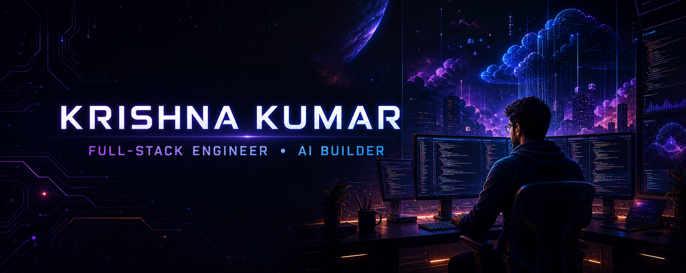

<br/>

<div align="center">

```
╔══════════════════════════════════════════════════════════════════╗
║                                                                  ║
║        ██╗  ██╗██████╗ ██╗███████╗██╗  ██╗███╗  ██╗ █████╗     ║
║        ██║ ██╔╝██╔══██╗██║██╔════╝██║  ██║████╗ ██║██╔══██╗    ║
║        █████╔╝ ██████╔╝██║███████╗███████║██╔██╗██║███████║    ║
║        ██╔═██╗ ██╔══██╗██║╚════██║██╔══██║██║╚████║██╔══██║    ║
║        ██║  ██╗██║  ██║██║███████║██║  ██║██║  ███║██║  ██║    ║
║        ╚═╝  ╚═╝╚═╝  ╚═╝╚═╝╚══════╝╚═╝  ╚═╝╚═╝  ╚══╝╚═╝  ╚═╝    ║
║                                                                  ║
║                     O  S     v  2  1  .  0                      ║
║                                                                  ║
╚══════════════════════════════════════════════════════════════════╝
```

</div>

<br/>

<div align="center">
  <a href="https://git.io/typing-svg">
    
  </a>
</div>

<br/>

<div align="center">

[](https://www.linkedin.com/in/krishna-kumar-89544b295)
[](mailto:krishnakumarsharma8077@gmail.com)
[](https://leetcode.com/u/krishnx_21/)
[](https://github.com/krishnx21)


</div>

<div align="center">


&nbsp;

&nbsp;


</div>

<br/>

---

## `[BOOT]` system initialising

```bash
krishnOS v21.0 — full-stack developer environment
copyright (c) 2024–2028 · krishna kumar · agra, india

[  OK  ] kernel     full-stack-engine.service ............ loaded
[  OK  ] service    backend-reliability.module ........... active
[  OK  ] service    ai-integration.daemon ................ running
[  OK  ] role       gssoc-2026-project-admin ............. verified  ★
[  OK  ] role       ssoc-2026-mentor ..................... confirmed
[ WARN ] skill      devops-docker.module ................. upgrading
[ INFO ] quest      certivault-v1.0.service .............. 43% done

———————————————————————————————————————————————————————————
  I'm a third-year CSE student who prefers shipping over
  studying theory. My interest is in how backends actually
  hold together — auth flows, cache layers, job queues,
  the invisible machinery most people never think about.

  This year: Project Admin at GSSoC 2026. I run a project,
  review PRs, and mentor contributors. Still catches me
  off guard that I'm doing this as a 2nd year.
———————————————————————————————————————————————————————————

system ready.
```

---

## `[SPECS]` hardware

```
┌──────────────────────────────────────────────────────────────────────┐
│                    SYSTEM  SPECIFICATIONS                            │
├──────────────────────────────────────────────────────────────────────┤
│  MODEL      Krishna Kumar  (unit: KK-21)                            │
│  CLASS      Full-Stack Engineer  +  AI Builder                      │
│  BUILD      B.Tech CSE  ·  HCST, Agra  ·  2024–2028                │
│  REGION     Agra, India  🌏                                          │
├──────────────────────────────────────────────────────────────────────┤
│                    PERFORMANCE  METRICS                              │
├──────────────────────────────────────────────────────────────────────┤
│                                                                      │
│  STR  Backend & APIs      ██████████████████░░░░  83   A            │
│  INT  Problem Solving     ████████████████████░░  89   A            │
│  DEX  Frontend / UI       ███████████████░░░░░░░  69   C            │
│  CON  System Design       ████████████████░░░░░░  74   B            │
│  WIS  AI Integration      █████████████████░░░░░  77   B            │
│  SPD  DevOps / Docker     ██████████████░░░░░░░░  65   C  ↑         │
│                                                                      │
│  XP  ▰▰▰▰▰▰▰▰▰▰▰▰▰▰▰▰▰▱▱▱▱▱▱▱▱▱▱▱▱▱  8,400 / 15,000  →  GOLD      │
│                                                                      │
├──────────────────────────────────────────────────────────────────────┤
│                    ACTIVE  LOADOUT                                   │
├──────────────────────────────────────────────────────────────────────┤
│                                                                      │
│  ⚔   PRIMARY     Node.js + Express + MongoDB    Backend Blade  Lv.3 │
│  🛡   SHIELD      Docker · Redis · AWS S3        Infra Guard   Lv.2 │
│  📖   TOME        Claude API · Python            AI Grimoire   Lv.2 │
│  🎯   QUEST       CertiVault v1.0  ──────────────  [ ACTIVE ]       │
│                                                                      │
└──────────────────────────────────────────────────────────────────────┘
```

---

## `[PROCESSES]` active & completed

<br/>

<table>
<tr>
<td width="50%" valign="top">

**`[PID 001]`  🏗 CertiVault** `— running`

Document management ++ verification platform. Not "upload a file" — this has Redis TTL expiring share links, BullMQ async queues, hash-based integrity verification, full-text search, and CI/CD. I'm building it the way I'd want a real product built.

```
status   ▓▓▓▓▓▓░░░░  43%  in progress
stack    MERN · S3 · Redis · BullMQ · Docker
```

</td>
<td width="50%" valign="top">

**`[PID 002]`  ☁️ Cloud File Sharing** `— exited(0)`

Backend-first file platform with JWT-protected links and Cloudinary storage. Built to genuinely understand access control — there's a lot between "add a password" and actually secure.

```
status   ██████████  complete
stack    Node.js · Express · JWT · Cloudinary
```

</td>
</tr>
<tr>
<td width="50%" valign="top">

**`[PID 003]`  🤖 AI Resume Analyzer** `— exited(0)`

Resume vs JD scorer via Claude API. The interesting problem wasn't the AI call — it was building the prompt layer that returns consistent structured JSON you can render in a real UI.

```
status   ██████████  complete
stack    React · Express · MySQL · Claude API
```

</td>
<td width="50%" valign="top">

**`[PID 004]`  🌤 Weather Dashboard** `— exited(0)`

Live forecasts, location search, humidity breakdowns. My first project where I cared about UX as much as whether it ran.

```
status   ██████████  complete
stack    JavaScript · CSS · Weather API
```

</td>
</tr>
</table>

<div align="center">
  <a href="https://github.com/krishnx21?tab=repositories">
    
  </a>
</div>

---

## `[PACKAGES]` installed drivers

<div align="center">

[](https://skillicons.dev)

<br/>


</div>

---

## `[BENCHMARKS]` performance data


<div align="center">
  
</div>

<br/>

---


## `[ROLES]` elevated permissions

<div align="center">

```
┌──────────────────────────────────────────────────────────────────┐
│                   OPEN SOURCE  ACCESS LOG                        │
├──────────────┬───────────────┬──────────────────────────────────┤
│  PROGRAM     │  YEAR / ROLE  │  SCOPE                           │
├──────────────┼───────────────┼──────────────────────────────────┤
│  ECSoC       │  2026         │  PROJECT ADMIN  ─  I own a       │
│              │               │  project. Review PRs, define     │
│              │               │  scope, guide contributors.      │
├──────────────┼───────────────┼──────────────────────────────────┤
│  SSOC        │  2026         │  MENTOR  ─  I help developers    │
│              │               │  ship their first open source    │
│              │               │  contributions.                  │
└──────────────┴───────────────┴──────────────────────────────────┘
```

</div>

---

## `[NETWORK]` commit activity

<div align="center">
  
</div>

<br/>

<div align="center">
  
</div>

---

## `[HISTORY]` process trail

<div align="center">
  <picture>
    <source media="(prefers-color-scheme: dark)"  srcset="https://raw.githubusercontent.com/krishnx21/krishnx21/output/snake-dark.svg"/>
    <source media="(prefers-color-scheme: light)" srcset="https://raw.githubusercontent.com/krishnx21/krishnx21/output/snake.svg"/>
    
  </picture>
</div>

---

## `[LOGS]` system philosophy

```diff
# /etc/krishna/core.conf

+ ship something imperfect rather than perfect nothing
+ understand why before understanding how
+ if it fails silently, it isn't done
+ the next developer is you at 3am — be kind to them
+ boring infrastructure is a feature, not a failure

- don't add complexity to feel productive
- don't optimize what you haven't measured
- don't call it done until edge cases have names
```

---

## `[STDOUT]` random output

<div align="center">
  
</div>

<br/>

<div align="center">
  
</div>

---

```bash
krishnOS v21.0 — shutdown sequence initiated

[  OK  ] saved session state
[  OK  ] flushed commit buffer
[  OK  ] all quests checkpointed

if you read this far — we should probably build something.

$ contact --email   krishnakumarsharma8077@gmail.com
$ contact --linkedin  /in/krishna-kumar-89544b295
$ contact --github    @krishnx21

— shutting down.  see you in the commits.
```

<div align="center">

[](mailto:krishnakumarsharma8077@gmail.com)
&nbsp;
[](https://www.linkedin.com/in/krishna-kumar-89544b295)

<br/><br/>


</div>
