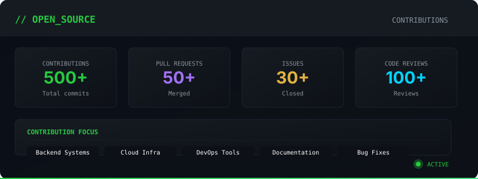

 

 

 

 

 

 

 

 

<h3 style="color:#00d4ff;font-family:'JetBrains Mono',monospace;letter-spacing:6px">// GITHUB_ACTIVITY // CONTRIBUTION_STREAM</h3>

> const uptime = "always building";

 

  

  

  

  

 

 

 

[01] CertiVault // <a href="https://github.com/Krishnx21/CertiVault" style="color:#00d4ff;text-decoration:none;">github.com/Krishnx21/CertiVault</a> 
[02] Smart File Sharing // <a href="#" style="color:#00d4ff;text-decoration:none;">coming soon</a> 
[03] AI Resume Analyzer // <a href="#" style="color:#00d4ff;text-decoration:none;">in development</a> 
[04] AI Customer Service // <a href="#" style="color:#00d4ff;text-decoration:none;">exploring</a> 
[05] OpsPilot // <a href="#" style="color:#00d4ff;text-decoration:none;">planned</a> 
[06] Open Source // <a href="https://github.com/Krishnx21" style="color:#00d4ff;text-decoration:none;">github.com/Krishnx21</a>

 

 

 

 

 

 

  

  

 

building systems since 2024 — always learning, always building. never giving up.

