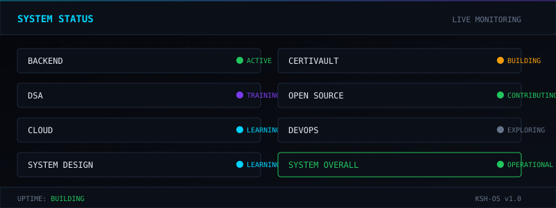
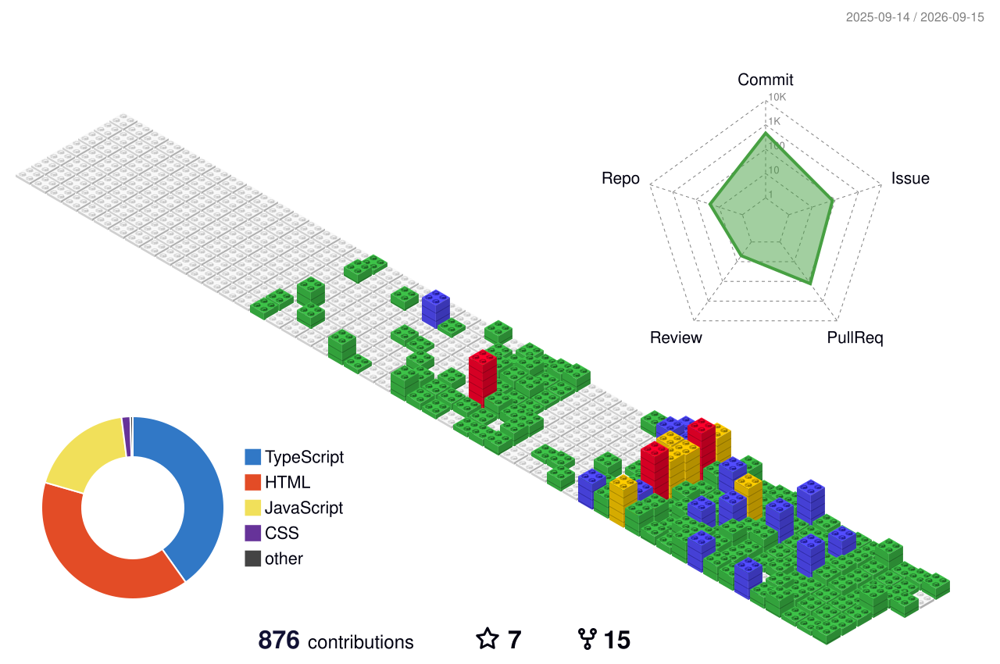
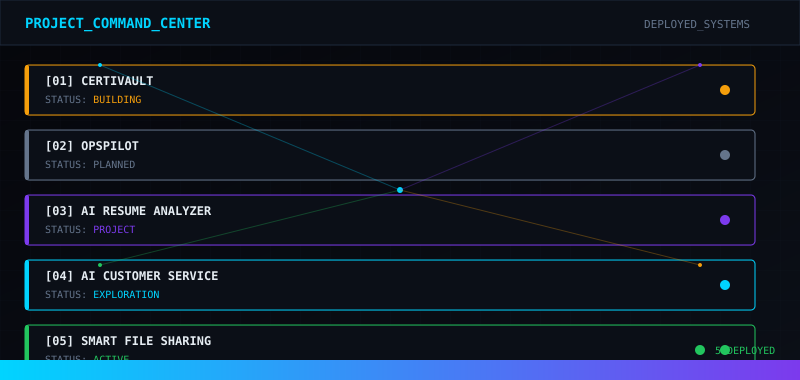
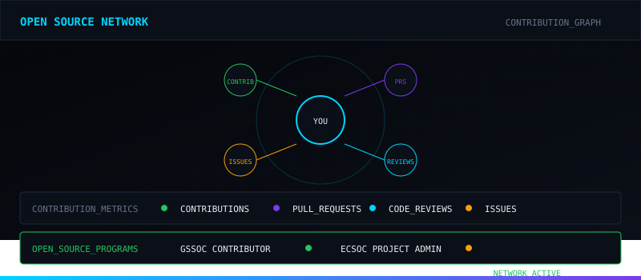

<!-- ⚡ DYNAMIC TYPING EFFECT -->

  

<!-- 👁️ PROFILE VISIBILITY -->

  

<!-- 🌈 CYBERPUNK BANNER -->

---

<!-- 🎨 YOUR ORIGINAL SVG ASSETS - ENHANCED -->



 

 



 

 




 

---

## 👨‍💻 About Me - The D

  <i>🚀 Passionate Full-Stack Developer with a mission to build transformative digital solution</i>

### 🎯  Identity
- **🏗️ Full-Stack Architect** - Designing and building scalable, production-ready applicati
- **🤖 AI/ML Pioneer** - Exploring the frontiers of artificial intelligence and machine learning
- **🌟 Open Source Visionary** - Believing in the power of community-driven
- **💡 Problem Solver** - Transforming complex challenges into elegant, efficient solution.
- **🌱 Continuous Learner** - Perpetually expanding knowledge and pushing technical boundaries
- **✨ Creative Technologist** - Turning abstract ideas into concrete digital 

### 💪 What Drives 
- 🔥 **Innovation** - Always seeking better ways to solve problems
- 🎯 **Excellence** - Committed to delivering high-quality, maintainable code
- 🤝 **Collaboration** - Believing in the power of team synergy
- 📚 **Knowledge Sharing** - Passionate about teaching and learning from others
- 🌍 **Impact** - Focused on building solutions that make a real difference

---

 




 

---

## 🛠️ Technical 

### 💻 Programming Languages & Core Skills

  &nbsp;&nbsp;&nbsp;
  &nbsp;&nbsp;&nbsp;
  &nbsp;&nbsp;&nbsp;
  &nbsp;&nbsp;&nbsp;
  &nbsp;&nbsp;&nbsp;
  

### 🎨 Frontend Mastery

  &nbsp;&nbsp;&nbsp;
  &nbsp;&nbsp;&nbsp;
  &nbsp;&nbsp;&nbsp;
  &nbsp;&nbsp;&nbsp;
  &nbsp;&nbsp;&nbsp;
  &nbsp;&nbsp;&nbsp;
  

###  Back

  &nbsp;&nbsp;&nbsp;
  &nbsp;&nbsp;&nbsp;
  &nbsp;&nbsp;&nbsp;
  &nbsp;&nbsp;&nbsp;
  &nbsp;&nbsp;&nbsp;
  

### 🗄️ Database & Data Engineering

  &nbsp;&nbsp;&nbsp;
  &nbsp;&nbsp;&nbsp;
  &nbsp;&nbsp;&nbsp;
  &nbsp;&nbsp;&nbsp;
  &nbsp;&nbsp;&nbsp;
  

### ☁️ Cloud & DevOps

  &nbsp;&nbsp;&nbsp;
  &nbsp;&nbsp;&nbsp;
  &nbsp;&nbsp;&nbsp;
  &nbsp;&nbsp;&nbsp;
  &nbsp;&nbsp;&nbsp;
  

---

 



 

---

## 📊 GitHub Analytics -

<h3 style="color:#00D4FF;font-family:'Cascadia Code',monospace;letter-spacing:6px">// GITHUB_PERFORMANCE_ANALYTICS // LIVE_METRICS</h3>

&gt; const system_status = "operational";

 

<!-- 🎯 LOCAL INTERACTIVE GITHUB STATS -->
<iframe src="./github-stats.html" width="100%" height="320" frameborder="0" style="border: 1px solid #1E293B; border-radius: 12px; box-shadow: 0 0 20px rgba(0, 212, 255, 0.1);"></iframe>

  

<!-- 🔥 CONTRIBUTION STREAK -->

  

<!-- 📈 ACTIVITY GRAPH -->

  

<!-- 🐍 CONTRIBUTION SNAKE -->
<h3 style="color:#00D4FF;font-family:'Cascadia Code',monospace;letter-spacing:4px">// CONTRIBUTION_SNAKE // LIVE_TRAIL</h3>

  

<!-- 🌐 3D CONTRIBUTION VISUALIZATION -->
<h3 style="color:#00D4FF;font-family:'Cascadia Code',monospace;letter-spacing:4px">// 3D_CONTRIBUTION_MATRIX // VISUALIZED</h3>
<a href="./simple-3d-graph.html">
  <picture>
    <source media="(prefers-color-scheme: dark)" srcset="./profile-3d-contrib/profile-night-rainbow.svg"/>
    
  </picture>
</a>

Click the visual to open the interactive 3D contribution experience.

---

 



 

---

## 🎯 Interactive Development Experience

### 💻 TERMINAL 
<iframe src="./interactive-terminal.html" width="100%" height="380" frameborder="0" style="border: 1px solid #1E293B; border-radius: 12px; box-shadow: 0 0 20px rgba(0, 212, 255, 0.1);"></iframe>

### 🌳 SKILL MASTERY TREE
<iframe src="./skill-tree.html" width="100%" height="520" frameborder="0" style="border: 1px solid #1E293B; border-radius: 12px; box-shadow: 0 0 20px rgba(0, 212, 255, 0.1);"></iframe>

---

 



 

---

## 🚀 Featured Projects - Innovation Portfolio

### 🏆 Current Active Projects
- **🤖 AI-Powered Analytics Dashboard** - Real-time data visualization with machine learning .
- **🛠️ Open Source Contribution Tools** - Automating GitHub workflows and development processes.
- **🏪 Full-Stack E-commerce Platform** - Scalable microservices architecture with modern tech stack.
- **📋 Smart Task Management System** - AI-enhanced productivity application with intelligent scheduling.
- **🌐 Cloud-Native Applications** - Serverless solutions with auto-scaling capabilities.

### 📚 Research & Development
- **🧠 Advanced React Patterns** - Performance optimization and advanced state management techniques
- **☁️ Cloud Native Development** - Kubernetes orchestration and serverless architecture patterns
- **🗣️ Natural Language Processing** - Text analysis, sentiment analysis, and language models
- **👁️ Computer Vision Applications** - Image processing, object detection, and visual recognition systems
- **🔗 Blockchain Integration** - Decentralized applications and smart contract development

---

 



 

---

## 🎯 Strategic Goals & Vision

### 🎯 Short-term Objectives (0-12 months)
- 🔥 **Master Advanced System Design** - Architecture patterns for large-scale applications
- 🤖 **Build Production AI/ML Systems** - Deploy machine learning models to production
- 🌍 **Contribute to Major Open Source** - Active participation in flagship projects
- 📚 **Knowledge Sharing Initiative** - Technical blogs, tutorials, and conference talks
- 🏆 **Industry Certifications** - Cloud architecture and development certifications

### 🚀 Long-term Vision (1-5 years)
- 💡 **Lead Innovative Tech Projects** - Spearhead transformative technical initiatives
- 🌐 **Global Developer Network** - Build connections with developers worldwide
- 🎓 **Mentorship Program** - Guide aspiring developers in their technical journey
- 🏢 **Tech Entrepreneurship** - Launch a startup focused on real-world problem solving
- 🌟 **Thought Leadership** - Become recognized voice in tech community

---

 



 

---

## 🏆 Achievements & Recognition

### 📊 Language Proficiency

  

---

 



 

---

## 🌟 Open Source Contributions

### 🤝 Community Engagement
- **Active Contributor** - Regular contributions to open source projects
- **Issue Resolver** - Helping solve community-reported issues
- **Documentation Improver** - Enhancing project documentation and guides
- **Code Reviewer** - Providing constructive feedback on pull requests
- **Mentor** - Helping new contributors get started with open source

### 🎯 Contribution Philosophy
- **Quality Over Quantity** - Focused, meaningful contributions
- **Sustainable Development** - Building maintainable, scalable solutions
- **Inclusive Community** - Welcoming diverse perspectives and contributions
- **Knowledge Sharing** - Documenting and sharing technical insights
- **Continuous Improvement** - Always learning from community feedback

---

 



 

---

## 📅 Development Journey

### 🚀 Key Milestones
- **🎯 Started Coding** - Beginning of the development journey
- **🏗️ First Full-Stack Project** - Complete end-to-end application development
- **🤖 AI/ML Exploration** - Diving into machine learning and artificial intelligence
- **☁️ Cloud Architecture** - Mastering cloud services and deployment
- **🌟 Open Source Recognition** - Community acknowledgment and contributions
- **🏆 Technical Leadership** - Leading development teams and projects

### 📈 Growth Metrics
- **📚 Continuous Learning** - Regular upskilling and knowledge expansion
- **🛠️ Project Portfolio** - Diverse range of completed projects
- **🤝 Network Growth** - Expanding professional connections
- **🎯 Skill Development** - Progressive enhancement of technical capabilities
- **🌍 Industry Awareness** - Staying current with technology trends

---

 



 

---

## 🔗 Connect & Collaborate


  

  <i>🤝 Let's build something amazing together!</i>

 

&nbsp;&nbsp;
&nbsp;&nbsp;
&nbsp;&nbsp;
&nbsp;&nbsp;
&nbsp;&nbsp;

  

---

## 🎉 Beyond Code - Personal Side

 

  
🎮

  
Gaming

  
Strategy & Puzzle Games

  
🎵

  
Music

  
Lo-fi Coding Beats

  
📚

  
Reading

  
Tech & Sci-Fi Books

  
☕

  
Coffee

  
Powered by Caffeine

  
🏃

  
Fitness

  
Mind & Body Balance

  
🌍

  
Travel

  
Exploring New Cultures

---



 

  <i>💫 "Code is poetry written for machines to understand and humans to appreciate."</i>

 

  🚀 <strong>Built with passion by Krishnx21</strong> 🚀

 

  ✨ Always shipping. Always learning. Always growing. ✨

