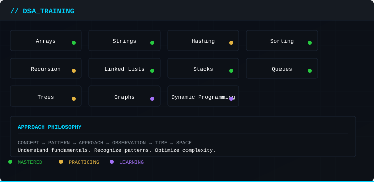
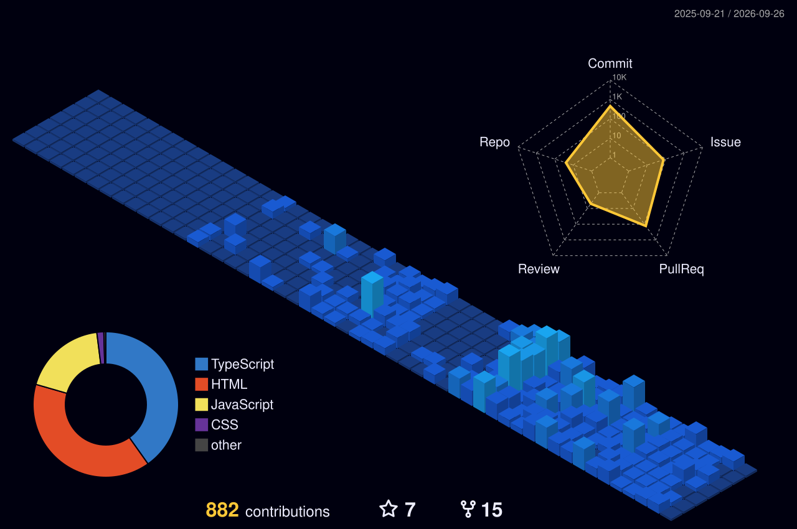

 

 

 

 

 

 

 

 

 

 

 

 

 

 

 

 

 

 

 

 

 

 

 

 

 

 

 

 

<h3 style="color:#00D4FF;font-family:'Cascadia Code',monospace;letter-spacing:6px">// GITHUB_ACTIVITY // CONTRIBUTION_STREAM</h3>

&gt; const uptime = "always building";

 

  

  

  

  

 

 

 

 

  

  

 

 