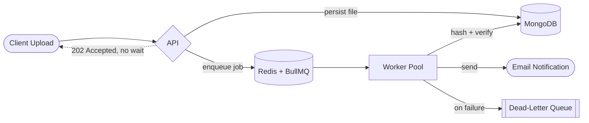

<div align="center">


<br/>

<a href="https://www.linkedin.com/in/krishna-kumar-89544b295"></a>
<a href="mailto:krishnakumarsharma8077@gmail.com"></a>
<a href="https://github.com/krishnx21"></a>

<br/><br/>


</div>

<br/>

# Changelog

All notable changes to **krishna-kumar** are documented in this file — a system doesn't get to skip its own logging practices just because the system is a person.

The format loosely follows [Keep a Changelog](https://keepachangelog.com/).
Status used below: 🟢 shipped · 🟡 in progress · ⚪ planned

<br/>

---

<br/>

## Design Principles

> **Reliability is a design decision, not a bugfix.**
> A system that works in the demo and falls over under concurrent writes isn't reliable, it's untested. I design for the failure case first — what happens if the worker dies mid-job, what happens if the same request arrives twice — and treat the happy path as the easy part.

> **Queues over blocking calls, whenever the work can wait.**
> If a request doesn't need to be answered synchronously, making the caller wait for it is a cost with no benefit. Offloading it to a queue keeps the API responsive under load, so a slow downstream dependency doesn't become the whole system's problem.

> **Caching is a trade-off, not a default.**
> Every cache is a promise to keep two copies of the truth in sync. I reach for it when the read cost is real and the staleness window is acceptable — not as a reflex for "making things faster."

> **Software should fail loud, not silent.**
> A try/catch that swallows an error is a bug wearing a disguise. If something fails, I want a log line, a retry policy, or a dead-letter queue — not a silent no-op that looks like success from the outside.

> **Observability is what turns "it's slow" into an actionable ticket.**
> Without logs, metrics, or traces, debugging production is guesswork with extra steps. I'd rather spend time instrumenting a system than debugging it blind.

<br/>

---

<br/>

## [Unreleased]

### CertiVault — smart document verification platform 🟡

*In plain terms: people can upload and share documents with confidence — every file is verified, every share link expires on its own, and nothing fails without someone finding out.*

**Added**
- Document upload with SHA-256 integrity verification, computed and stored at upload time
- Role-based access control
- Expiring, JWT-scoped share links
- Background job processing via BullMQ + Redis — hashing, notifications, and a dead-letter queue for failed jobs

**Changed**
- Verification and notification moved off the request path entirely. The API's job now is just: persist the file, enqueue the work, respond. A slow hash computation or a flaky email provider no longer makes anyone wait.

**Architecture**


```mermaid
flowchart LR
    A([Client Upload]) --> B{API}
    B -->|persist file| D[(MongoDB)]
    B -->|enqueue job| C[(Redis + BullMQ)]
    B -. 202 Accepted, no wait .-> A
    C --> W[Worker Pool]
    W -->|hash + verify| D
    W -->|send| N([Email Notification])
    W -->|on failure| X[[Dead-Letter Queue]]
```

*The upload request returns immediately — verification and notification happen entirely off the request path.*

**Notes**
The hardest part wasn't any single feature — it was the coordination problems that only show up outside the happy path: two requests hitting the same document at once, a share link that outlives its intended use, a worker that dies mid-job and needs its work picked back up rather than lost.

`Node.js` `Express` `MongoDB` `Redis` `BullMQ` `Docker` `JWT` `Google OAuth` `Cloudinary`

<br/>

### Planned

- **SecretSentinel** — self-hosted secret scanning + rotation intelligence. Deliberately different stack from CertiVault (PostgreSQL, Kubernetes, Terraform) — the scan engine (regex + Shannon entropy detection) is the core problem. Starts once CertiVault ships.
- Kubernetes, Terraform, distributed systems — in progress, not yet stable

<br/>

---

<br/>

## [2.0.0] — Cloud File Sharing 🟢

**Added**
- JWT-scoped share links with defined access windows
- Cloudinary-backed storage, so the app isn't managing raw file I/O itself

**Security**
- *Issue:* a share link's expiry was meant to be enforced by a downstream check that, in one code path, wasn't wired up — so the link never expired. Nothing crashed. Nothing logged. It just worked, for anyone who had the link, forever.
- *Root cause:* authorization gaps don't announce themselves the way authentication gaps do. A missing `401` shows up in five seconds of testing. A missing expiry check only shows up if someone thinks to test the *invalid* case, not just the valid one.
- *Fix:* expiry moved into the token's own claims, checked at verification time — not left to a separate, easy-to-forget cleanup step.

**Notes**
Authorization is much easier to get wrong quietly than authentication is. I now test "does this correctly reject" with the same care as "does this correctly accept."

`Node.js` `Express` `JWT` `Cloudinary`

<br/>

---

<br/>

## [1.1.0] — AI Resume Analyzer 🟢

**Added**
- Resume scoring against a specific job description via the Claude API
- Structured, UI-renderable feedback instead of a wall of text

**Fixed**
- Inconsistent LLM output shape — enforced an explicit output schema so parsing succeeds on every call, not just most, even when the input resume is messy

**Notes**
Prompting an LLM for a UI-facing feature is an API contract problem as much as a prompting problem.

`React` `Express` `MySQL` `Claude API`

<br/>

---

<br/>

## [1.0.0] — Weather Dashboard 🟢

**Added**
- Live forecasts with location search — initial release

**Notes**
No hard backend problem here by design — this was the first project where interface quality mattered as much as function, and that was its own useful exercise. Not every project needs to be the hard one.

`JavaScript` `CSS` `Weather API`

<br/>

---

<br/>

## Dependencies

```json
{
  "name": "krishna-kumar",
  "status": "open-to-internship-offers",
  "languages": ["JavaScript", "TypeScript", "Python", "Java", "C"],
  "dependencies": {
    "backend": ["Node.js", "Express", "REST APIs", "JWT", "OAuth 2.0", "Redis", "BullMQ"],
    "data": ["MongoDB", "Mongoose", "MySQL"],
    "infra": ["Docker", "GitHub Actions", "AWS", "Render", "Vercel", "Cloudinary"]
  },
  "devDependencies": {
    "testing": ["Jest", "Supertest"],
    "tooling": ["Git", "GitHub", "VS Code", "Postman", "ESLint", "Prettier", "npm"]
  },
  "scripts": {
    "learn:infra": "terraform plan && kubectl apply -f manifests/",
    "review-pr": "check-failure-path && explain-why",
    "contact": "see Install section below"
  }
}
```

<sub>Self-assessed, updated as I go — not a certification tracker.</sub>

<br/>

---

<br/>

## Maintainers

| Project | Role | Responsibilities |
|---|---|---|
| **ECSoC 2026** | Project Admin | scope, roadmap, final review on every PR before it merges |
| **SSOC 2026** | Mentor | get first-time contributors to a merged PR |
| **GSSoC 2026** | Contributor | active across issues and PRs on other maintainers' projects |

Running a project rather than just contributing to one changes what you're responsible for. Reviewing a PR isn't just "does this work" — it's judging whether a contributor's approach fits the project's direction, clearly enough that a first-time contributor learns something instead of just getting a rejection.

**Review checklist**
- [ ] Handles the failure case, not just the happy path
- [ ] The next contributor would understand *why*, not just *what*
- [ ] Fits the project's direction — not just "it works"

<br/>

---

<br/>

## Metrics

<div align="center">


<br/><br/>


<br/>


<br/>


<br/>


</div>

<br/>

---

<br/>

## Install

```bash
$ npm install krishna-kumar
npm error 404 Not Found — not published, only available via direct offer
```

Reach out directly instead:

<div align="center">

<a href="mailto:krishnakumarsharma8077@gmail.com"></a>
<a href="https://www.linkedin.com/in/krishna-kumar-89544b295"></a>
<a href="https://github.com/krishnx21"></a>

<br/><br/>


</div>
